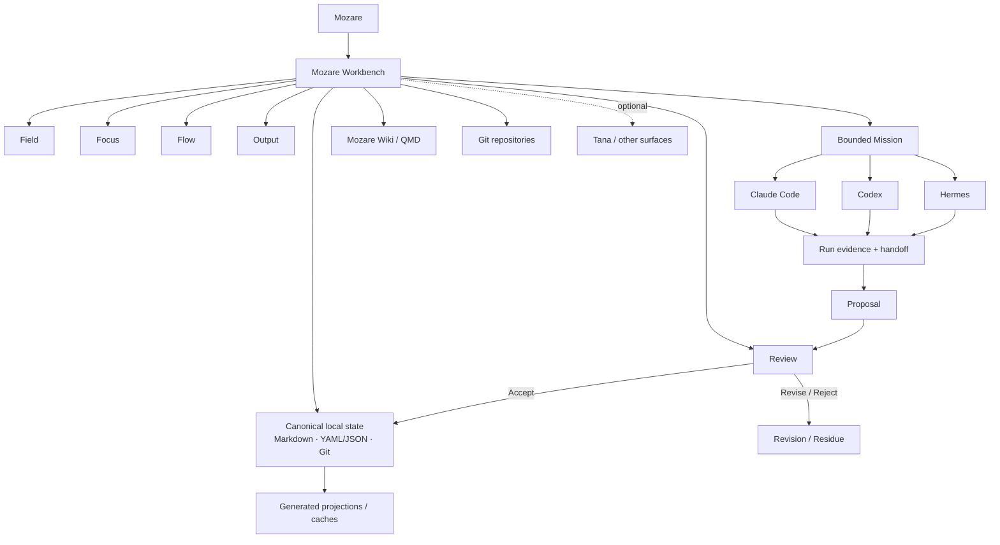
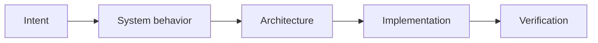
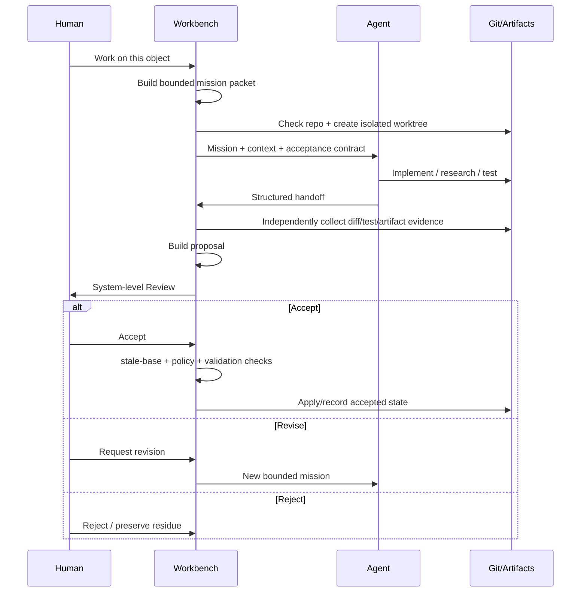
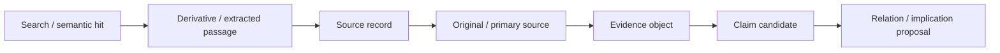
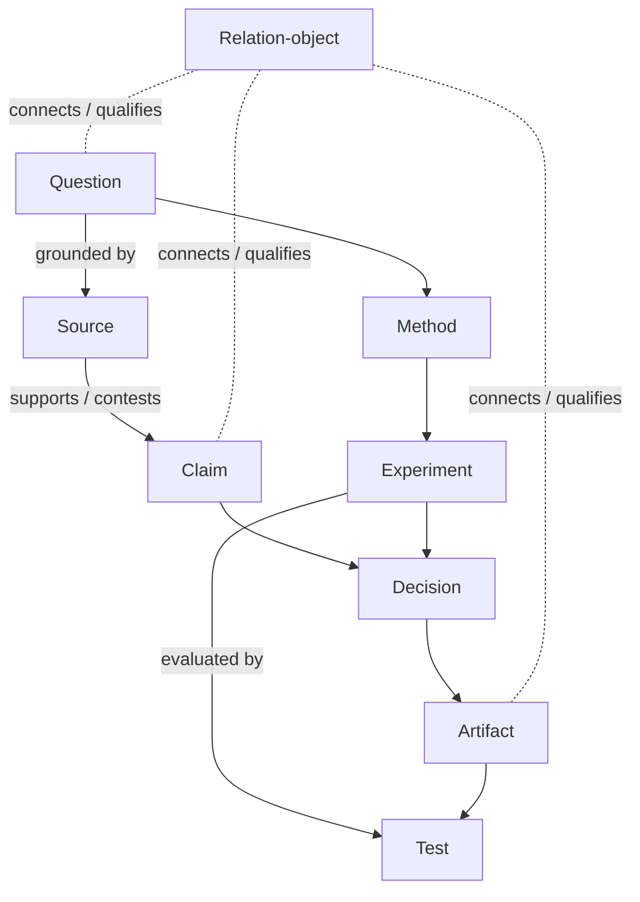
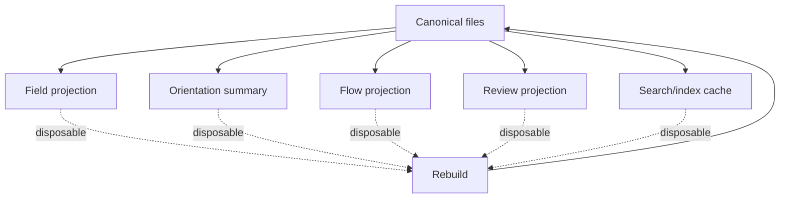

# 13 — Ready-Made Architecture / Process Diagrams

These Mermaid diagrams are implementation assets. They may be rendered in the Workbench's System/Flow surfaces, documentation, or review artifacts. Their semantics matter more than their eventual styling.

## 1. Whole system

## 2. Human review ladder

Default Review opens at `Intent` and `System behavior`. Deeper levels remain one interaction away.

## 3. Mission transaction

## 4. Authority-aware research route

No arrow means automatic truth. Each transition records provenance and evidence state.

## 5. Project field grammar

## 6. Canonical vs generated

The final arrow means views are rebuilt **from** canonical state; it does not mean views write back automatically.
